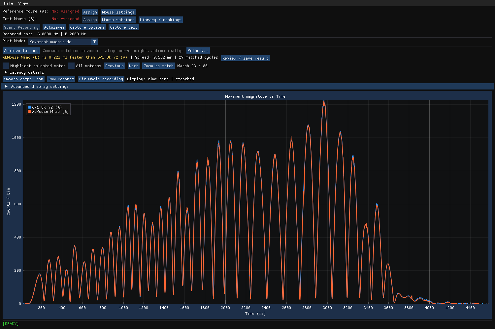
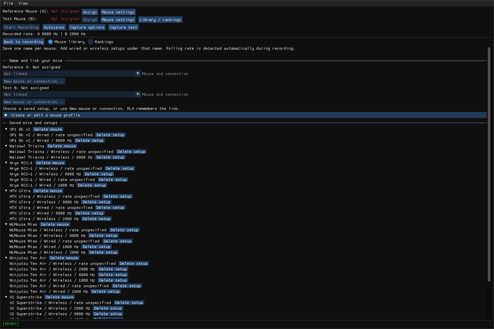
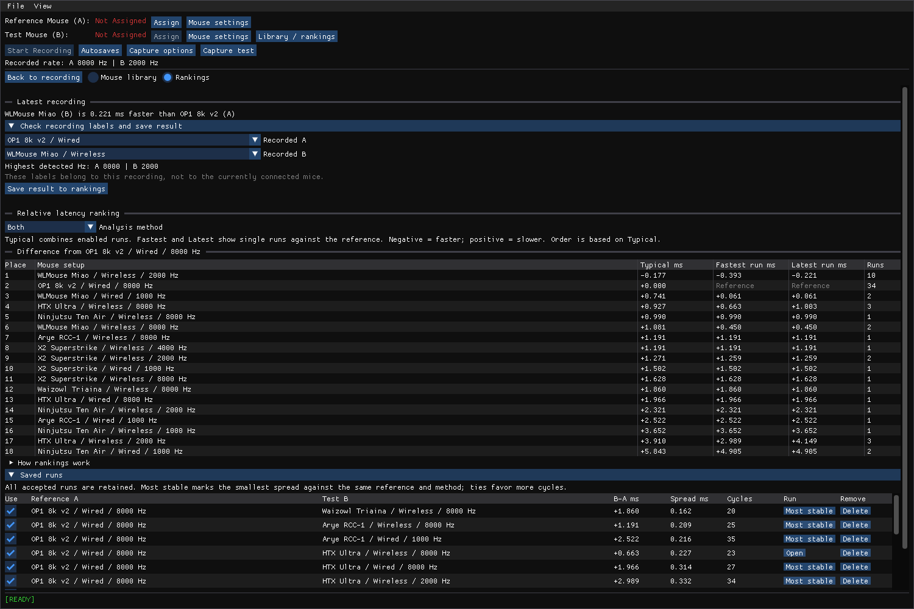

# Relative Latency Analyzer (RLA)

Compare the movement timing of two mice on Windows. Record both mice, inspect their curves, and keep results under named wired or wireless setups.

**[Download for Windows x64](https://github.com/scherzma/RLA/releases/latest)** · [Installation guide](docs/INSTALL.md) · [Build from source](docs/BUILD.md)



*A real saved recording. The displayed result applies to that run and mouse setup.*

## Install

1. Download **RLA-1.0.0-windows-x64.zip** from [Releases](https://github.com/scherzma/RLA/releases/latest).
2. Extract it and open **RLA.exe**.

No Visual Studio or separate C++ runtime installation is needed for the portable release. Use Windows 10 or 11, x64, with DirectX 11 graphics support. See the [installation guide](docs/INSTALL.md) for updates, saved files, and troubleshooting.

## Record and compare

1. **Assign A and B.** Move only the mouse you are assigning. Use **Mouse settings** to name each device and select wired or wireless.
2. **Start Recording.** The graph opens automatically. Move both mice together through several smooth cycles.
3. **Stop with a click or Esc.** The completed recording is saved automatically.
4. **Analyze latency.** RLA names the faster mouse and shows the difference in milliseconds. Linked mice can be analyzed and ranked automatically.
5. **Inspect the result.** Use **Previous**, **Next**, and **Zoom to match**. Turn match highlights on only when you need them.

Hz is detected automatically for each recording. RLA keeps the highest detected standard rate from **125, 250, 500, 1000, 2000, 4000, or 8000 Hz**. **Recorded rate** shows what was stored. Sparse or unsuitable movement can leave the rate unknown.

Choose **Event timing / Hz** under **Plot Mode** to inspect event intervals and movement event rates. **Smooth comparison** makes the movement curves easier to compare; **Raw reports** shows the original report values.

## Keep a mouse library



Use one name for each physical mouse. Link its wired and wireless connections to that name. Connection and detected Hz have separate ranking entries; DPI does not. Add notes when you want to compare other settings separately.

Delete buttons remove mice, setups, or results after confirmation. Removing a mouse also removes its setups and related ranking results. Recording files stay saved.

## Read the ranking



- **Typical:** combines enabled runs. The table is sorted by this result.
- **Fastest run:** the lowest single-run difference against the named reference.
- **Latest run:** the most recently saved result against that reference.

**Negative means faster; positive means slower.** Click a fastest or latest value to open that recording. Separate tables appear only when no comparison connects their mice. Their places cannot be compared with each other. Screenshots show real saved results; they are not a universal ranking of these mice.

## Saved files

RLA stores data in `%LOCALAPPDATA%\RLA`:

| Path | Contents |
| --- | --- |
| `Autosaves` | Completed recordings |
| `Runs` | Recordings retained for ranking results |
| `mice.json` | Mouse names, device links, and results |
| `Diagnostics` | Logs for an unresponsive application |

Use **Autosaves > Open folder** to find recordings. **File > Load Session** opens them again. Updating the executable preserves these files.

## Build without the Visual Studio IDE

Install Microsoft C++ Build Tools with **Desktop development with C++** and **C++ CMake tools for Windows**. Then run from PowerShell:

```powershell
git clone https://github.com/scherzma/RLA.git
cd RLA
git clone https://github.com/microsoft/vcpkg.git ..\vcpkg
..\vcpkg\bootstrap-vcpkg.bat
powershell -NoProfile -ExecutionPolicy Bypass -File .\build.ps1 -VcpkgRoot ..\vcpkg -Test -Package
```

This uses CMake, Ninja, and vcpkg. The executable is `out/cmake-release/RLA.exe`. See [Build from source](docs/BUILD.md) for prerequisites, direct CMake commands, and the Visual Studio option. Microsoft documents the [standalone command-line Build Tools](https://learn.microsoft.com/en-us/cpp/build/building-on-the-command-line).

## Measurement limits

Results compare mouse movement with application arrival timestamps. They are not isolated USB or sensor latency measurements. Motion differences, event batching, and other input software can affect a result. Use repeated runs and inspect the curves. **Spread** describes variation, not accuracy.

Close input-sharing software when testing. In local tests, active Synergy reduced the combined observed event rate; closing it restored the rate. This is a local observation, not a claim about every system.

[Technical details](docs/TECHNICAL.md) · [Regression checks](tests/README.md) · [Capture diagnostic tools](tools/RawInputProbe/README.md)
